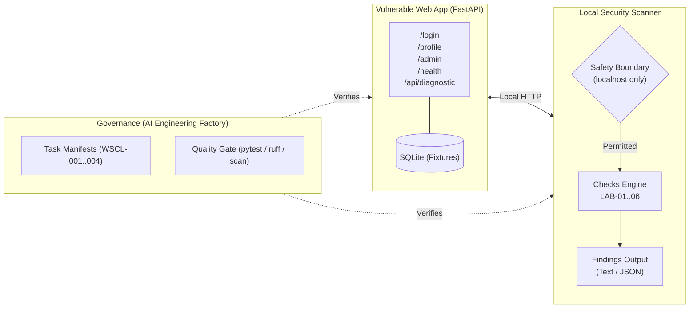

# Web Security Control Lab

[](https://github.com/moruku36/web-security-control-lab/actions/workflows/ci.yml)
[](LICENSE)

An educational, local web security laboratory designed to understand, observe, detect, remediate, and independently verify common web security misconfigurations and access control defects.

---

## Purpose

This laboratory provides an end-to-end learning loop:
**Attack / Observation &rarr; Detection (Scanner) &rarr; Explanation &rarr; Remediation &rarr; Verification**

Target Audience:
- Engineers learning Web Application Security
- Candidates preparing for the Information Security Specialist Examination (情報処理安全確保支援士)
- DevSecOps and Cloud Security practitioners establishing automated security gates

---

## Architecture



---

## Quick Start

### Prerequisites
- Python 3.11+
- Virtual environment tool (`venv`) or Docker

### Run Locally with Python
```bash
# 1. Clone the repository
git clone https://github.com/moruku36/web-security-control-lab.git
cd web-security-control-lab

# 2. Set up virtual environment and install dependencies
python -m venv .venv
# On Windows:
.\.venv\Scripts\activate
# On Linux/macOS:
source .venv/bin/activate

pip install -e .[dev]

# 3. Start the application (defaults to VULNERABLE mode)
uvicorn app.main:app --host 127.0.0.1 --port 8000
```

### Run with Docker Compose
```bash
docker compose up --build
```
Access the application at `http://127.0.0.1:8000`.

---

## Test Credentials
> **TEST CREDENTIALS - DO NOT USE IN PRODUCTION**
> All credentials are mock fixtures for local educational use only:
> - **Standard User**: `alice` / `user` (Role: `user`)
> - **Admin User**: `admin` / `admin` (Role: `admin`)

---

## Lab Scenarios (Intentional Weaknesses)

The lab currently initializes in `VULNERABLE` mode with 6 intentional security defects:

| Lab ID | Name | Severity | Description |
| :--- | :--- | :--- | :--- |
| **LAB-01** | Broken Access Control | **HIGH** | Regular user `alice` can access administrative routes (`/admin`) without role verification. |
| **LAB-02** | Missing HttpOnly Flag | **MEDIUM** | Session cookie (`lab_session`) is exposed to client-side scripts via `document.cookie`. |
| **LAB-03** | Weak / Missing SameSite | **MEDIUM** | Session cookie lacks `SameSite=Lax/Strict`, exposing requests to CSRF. |
| **LAB-04** | Missing Security Headers | **MEDIUM** | `Content-Security-Policy`, `X-Content-Type-Options`, and `Referrer-Policy` headers are absent. |
| **LAB-05** | Information Disclosure | **LOW** | `/api/diagnostic` returns detailed execution stack traces and framework versions. |
| **LAB-06** | Authentication Logging Failure | **MEDIUM** | Failed login attempts fail to produce security audit log records (`AUTH_FAILURE`). |

For full details, see [docs/SECURITY_CONTROLS.md](docs/SECURITY_CONTROLS.md) and [docs/LAB_GUIDE.md](docs/LAB_GUIDE.md).

---

## Security Scanner

The built-in CLI scanner audits local target instances and generates findings.

### Basic Scan
```bash
security-lab scan http://127.0.0.1:8000
```

**Sample Output:**
```text
Web Security Control Lab
[HIGH] LAB-01 Broken Access Control
  /admin is accessible by a non-admin user
[MEDIUM] LAB-02 Session Cookie
  HttpOnly flag is missing
[MEDIUM] LAB-03 Session Cookie
  SameSite policy is missing
[MEDIUM] LAB-04 Security Header
  Content-Security-Policy is missing
[LOW] LAB-05 Information Disclosure
  Detailed error information is exposed
[MEDIUM] LAB-06 Security Logging
  Failed authentication attempt was not recorded

Summary
  HIGH: 1
  MEDIUM: 4
  LOW: 1
```

### Machine-Readable JSON Output
```bash
security-lab scan http://127.0.0.1:8000 --format json
```

---

## Safety Boundary & Constraints

This project is strictly for local educational use.
- **Fail-Closed Target Safety**: The scanner refuses any URL that does not resolve to `localhost`, `127.0.0.1`, `::1`, or the Docker network.
- **Prohibited**: Scanning external hosts, weaponized payload generation, remote exploits, or production deployment.

---

## AI Engineering Factory Workflow

This repository integrates with [ai-engineering-factory](https://github.com/moruku36/ai-engineering-factory) for agent governance:
- `factory/tasks/wscl-001.yaml`: Vulnerable App Implementation (Phase 1, DONE)
- `factory/tasks/wscl-002.yaml`: Local Security Scanner (Phase 2, DONE)
- `factory/tasks/wscl-003.yaml`: Security Remediation & Hardening (**RESERVED FOR SONNET 5**)
- `factory/tasks/wscl-004.yaml`: Educational Documentation Suite (Phase 4, DONE)

---

## Learning Path & Documentation

- [docs/ARCHITECTURE.md](docs/ARCHITECTURE.md): Architectural design and boundary enforcement.
- [docs/LAB_GUIDE.md](docs/LAB_GUIDE.md): Hands-on reproduction and observation instructions.
- [docs/SECURITY_CONTROLS.md](docs/SECURITY_CONTROLS.md): Deep-dive into each control (What, Why, Detection, Fix, OWASP).
- [docs/SECURITY_SPECIALIST_NOTES.md](docs/SECURITY_SPECIALIST_NOTES.md): Exam preparation notes for 情報処理安全確保支援士 (SC).
- [HANDOFF_TO_SONNET.md](HANDOFF_TO_SONNET.md): Handoff contract for Sonnet 5 / Claude Code remediation.

---

## Repository Structure

```text
web-security-control-lab/
├── .github/
│   └── workflows/
│       └── ci.yml
├── app/
│   ├── templates/
│   ├── auth.py
│   ├── config.py
│   ├── db.py
│   └── main.py
├── scanner/
│   ├── checks.py
│   ├── cli.py
│   ├── models.py
│   ├── reporter.py
│   └── target.py
├── tests/
│   ├── integration/
│   ├── unit/
│   ├── vulnerabilities/
│   └── conftest.py
├── docs/
│   ├── ARCHITECTURE.md
│   ├── LAB_GUIDE.md
│   ├── SECURITY_CONTROLS.md
│   └── SECURITY_SPECIALIST_NOTES.md
├── factory/
│   └── tasks/
│       ├── wscl-001.yaml
│       ├── wscl-002.yaml
│       ├── wscl-003.yaml
│       └── wscl-004.yaml
├── docker-compose.yml
├── Dockerfile
├── HANDOFF_TO_SONNET.md
├── pyproject.toml
├── README.md
└── SECURITY.md
```
