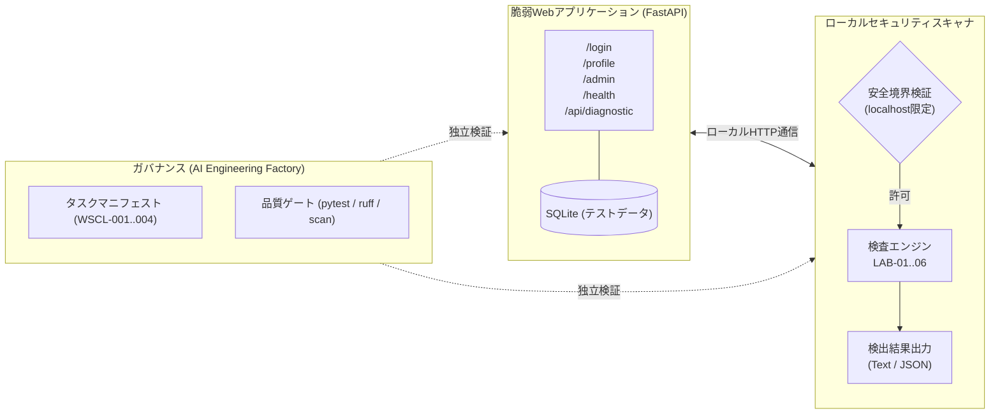

# Web Security Control Lab

[](https://github.com/moruku36/web-security-control-lab/actions/workflows/ci.yml)
[](LICENSE)

Webアプリケーションのセキュリティ設定ミスや認証・認可不備を、**脆弱版 &rarr; 検出 &rarr; 分析 &rarr; 修正 &rarr; 再検証**という一連のサイクルで学習・検証できるローカル専用の小型Security Labです。

---

## 目的 (Purpose)

単なる脆弱アプリの攻撃体験にとどまらず、防御・統制（Security Control）の視点から以下を一貫して学べる教育用リポジトリです。
**Attack/Observation（観察） &rarr; Detection（スキャナ検出） &rarr; Explanation（原因分析） &rarr; Remediation（修正） &rarr; Verification（再検証）**

主な対象読者:
- Webセキュリティの基礎・実践を学びたいエンジニア
- 情報処理安全確保支援士（登録セキスペ）の受験者
- DevSecOps やクラウドセキュリティの自動検証（Quality Gate）を学びたいエンジニア

---

## アーキテクチャ (Architecture)



---

## クイックスタート (Quick Start)

### 必要要件
- Python 3.11 以上
- 仮想環境ツール（`venv`）または Docker

### Pythonローカル実行
```bash
# 1. リポジトリのクローン
git clone https://github.com/moruku36/web-security-control-lab.git
cd web-security-control-lab

# 2. 仮想環境の作成と依存ライブラリのインストール
python -m venv .venv
# Windowsの場合:
.\.venv\Scripts\activate
# Linux/macOSの場合:
source .venv/bin/activate

pip install -e .[dev]

# 3. アプリケーションの起動（デフォルトは脆弱モード: VULNERABLE）
uvicorn app.main:app --host 127.0.0.1 --port 8000
```

### Docker Compose での起動
```bash
docker compose up --build
```
起動後、ブラウザで `http://127.0.0.1:8000` にアクセスします。

---

## テスト用アカウント (Test Credentials)
> [!WARNING]
> **TEST CREDENTIALS - DO NOT USE IN PRODUCTION**  
> 以下の認証情報はローカル演習専用の固定データです。本番環境では決して使用しないでください。
> - **一般ユーザー**: `alice` / `user` (Role: `user`)
> - **管理者ユーザー**: `admin` / `admin` (Role: `admin`)

---

## 実装済みの脆弱性シナリオ (Lab Scenarios)

本Labは初期状態で `VULNERABLE`（脆弱状態）として起動し、以下の6つの設定不備・脆弱性を意図的に含んでいます。

| Lab ID | 脆弱性名称 | 重要度 | 概要 |
| :--- | :--- | :--- | :--- |
| **LAB-01** | Broken Access Control（認可不備） | **HIGH** | 一般ユーザー（`alice`）がロール検証を迂回して管理者用画面（`/admin`）にアクセス可能。 |
| **LAB-02** | Missing HttpOnly Flag（Cookie保護不備） | **MEDIUM** | セッションCookie（`lab_session`）に`HttpOnly`属性が付与されておらず、JavaScriptからアクセス可能。 |
| **LAB-03** | Weak / Missing SameSite（CSRF対策不備） | **MEDIUM** | セッションCookieに`SameSite`属性が指定されておらず、クロスサイトリクエスト時に送信される危険性がある。 |
| **LAB-04** | Missing Security Headers（HTTPヘッダー不備） | **MEDIUM** | `Content-Security-Policy`、`X-Content-Type-Options`、`Referrer-Policy` などの防御ヘッダーが未設定。 |
| **LAB-05** | Information Disclosure（詳細エラー露出） | **LOW** | `/api/diagnostic` がスタックトレースやフレームワークの内部情報をレスポンスに露出。 |
| **LAB-06** | Authentication Logging Failure（ログ記録不備） | **MEDIUM** | ログイン失敗時にセキュリティ監査ログ（`AUTH_FAILURE`）が記録されない。 |

技術的背景や修正方法の詳細は [docs/SECURITY_CONTROLS.md](docs/SECURITY_CONTROLS.md) および [docs/LAB_GUIDE.md](docs/LAB_GUIDE.md) を参照してください。

---

## セキュリティスキャナ (Security Scanner)

ローカルで稼働中の対象アプリを自動監査し、検出結果を出力するCLIツールです。

### 基本スキャン（テキスト出力）
```bash
security-lab scan http://127.0.0.1:8000
```

**出力例:**
```text
Web Security Control Lab
[HIGH] LAB-01 Broken Access Control
  /admin is accessible by a non-admin user
[MEDIUM] LAB-02 Session Cookie
  HttpOnly flag is missing
[MEDIUM] LAB-03 Session Cookie
  SameSite policy is missing
[MEDIUM] LAB-04 Security Header
  Content-Security-Policy is missing
[LOW] LAB-05 Information Disclosure
  Detailed error information is exposed
[MEDIUM] LAB-06 Security Logging
  Failed authentication attempt was not recorded

Summary
  HIGH: 1
  MEDIUM: 4
  LOW: 1
```

### 機械可読な JSON 出力
CIやAIパイプライン向けの構造化出力が可能です。
```bash
security-lab scan http://127.0.0.1:8000 --format json
```

---

## 安全設計と制約 (Safety Boundary)

本プロジェクトは安全な教育・自己学習専用です。誤用や不正利用を防止するため、以下の防護策をハードコードしています。
- **Fail-Closed な対象検証**: スキャナは `localhost`、`127.0.0.1`、`::1`、またはDocker内部ネットワーク以外へのリクエストを即座に拒否（終了コード 2）します。
- **禁止事項**: 外部ホストのスキャン、攻撃ペイロードの自動生成、リモート悪用コード、本番ネットワークへの配備。

---

## AI Engineering Factory との開発フロー

本リポジトリは [ai-engineering-factory](https://github.com/moruku36/ai-engineering-factory) によるAIエージェントガバナンスに対応しています。
- `factory/tasks/wscl-001.yaml`: 脆弱Webアプリケーション基盤（Phase 1: 完了）
- `factory/tasks/wscl-002.yaml`: ローカルセキュリティスキャナ（Phase 2: 完了）
- `factory/tasks/wscl-003.yaml`: セキュリティ改修・堅牢化（Phase 3: **Claude Code / Sonnet 5 担当用に予約**）
- `factory/tasks/wscl-004.yaml`: 学習・教育ドキュメント一式（Phase 4: 完了）

---

## 学習ガイド・関連ドキュメント (Documentation)

- [docs/ARCHITECTURE.md](docs/ARCHITECTURE.md): システム構成と安全境界アーキテクチャの解説
- [docs/LAB_GUIDE.md](docs/LAB_GUIDE.md): 各脆弱性の手動再現・観察・検証手順
- [docs/SECURITY_CONTROLS.md](docs/SECURITY_CONTROLS.md): 各セキュリティ統制の理論・検知ロジック・修正コード・OWASP対応
- [docs/SECURITY_SPECIALIST_NOTES.md](docs/SECURITY_SPECIALIST_NOTES.md): 情報処理安全確保支援士（登録セキスペ）試験対策ノート
- [HANDOFF_TO_SONNET.md](HANDOFF_TO_SONNET.md): Sonnet 5 / Claude Code への改修引き継ぎ書

---

## リポジトリ構成 (Repository Structure)

```text
web-security-control-lab/
├── .github/
│   └── workflows/
│       └── ci.yml             # GitHub Actions 自動テスト・リント
├── app/                       # 脆弱Webアプリケーション本体 (FastAPI)
│   ├── templates/             # Jinja2 HTMLテンプレート
│   ├── auth.py                # 認証・セッション管理 (LAB-02, 03, 06)
│   ├── config.py              # 設定・テスト用フィクスチャ
│   ├── db.py                  # SQLiteデータ管理
│   └── main.py                # ルーティング・Middleware (LAB-01, 04, 05)
├── scanner/                   # セキュリティスキャナ本体
│   ├── checks.py              # LAB-01〜06 監査ロジック
│   ├── cli.py                 # CLIコマンドパーサー
│   ├── models.py              # レポートデータモデル
│   ├── reporter.py            # テキスト/JSON出力フォーマッタ
│   └── target.py              # localhost限定の安全バリデータ (Fail-Closed)
├── tests/                     # 自動検証テストスイート (pytest)
│   ├── integration/           # アプリ結合テスト
│   ├── unit/                  # スキャナ・バリデータ単体テスト
│   ├── vulnerabilities/       # 意図的脆弱性の存在確認テスト
│   └── conftest.py            # テスト用フィクスチャ
├── docs/                      # 技術解説・学習ノート
├── factory/                   # AI Engineering Factory タスクマニフェスト
├── docker-compose.yml         # コンテナ起動定義
├── Dockerfile                 # コンテナイメージビルド定義
├── HANDOFF_TO_SONNET.md       # Sonnet 5 向け引き継ぎ書
├── pyproject.toml             # プロジェクト設定・依存関係
├── README.md                  # プロジェクト総合ガイド
└── SECURITY.md                # セキュリティポリシー
```
