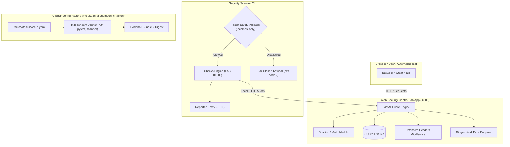

# Architecture Overview

`web-security-control-lab` is structured into three decoupled layers:
1. **Target Web Application (`app/`)**: FastAPI-based local educational web service with configurable state (`VULNERABLE` / `HARDENED`).
2. **Security Control Scanner (`scanner/`)**: Python CLI tool enforcing a strict localhost-only safety boundary (Fail-Closed).
3. **Governance & Verification Layer (`factory/` and `ai-engineering-factory`)**: Declarative machine-readable task manifests and reproducible test/lint gates.

## System Interaction Diagram

## Security Boundary & Fail-Closed Guardrail
The scanner (`scanner/target.py`) explicitly permits only:
- `http://localhost:<port>`
- `http://127.0.0.1:<port>`
- `http://[::1]:<port>`
- `http://web-security-control-lab-app:<port>`

Any public IP, remote host, or domain outside this set causes immediate termination without issuing any network requests.
