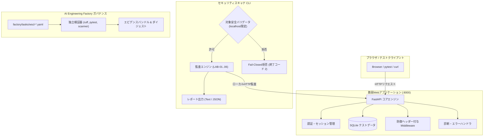

# アーキテクチャ概要 (Architecture Overview)

`web-security-control-lab` は、疎結合された3つのレイヤーで構成されています。

1. **対象Webアプリケーション (`app/`)**: 設定フラグ（`VULNERABLE` / `HARDENED`）で挙動を切り替え可能な、FastAPIベースのローカル教育用Webサービス。
2. **セキュリティ統制スキャナ (`scanner/`)**: `localhost` 以外へのリクエストを確実に遮断するFail-Closedな安全境界を備えたPython製CLIツール。
3. **ガバナンス・独立検証レイヤー (`factory/` および `ai-engineering-factory`)**: 宣言的な機械可読タスクマニフェストと、再現可能なテスト・リントによる品質ゲート。

## システム相互作用図 (System Interaction Diagram)

## 安全境界と Fail-Closed ガードレール (Security Boundary)
スキャナ（`scanner/target.py`）が許可するターゲットは以下に厳格に制限されています:
- `http://localhost:<port>`
- `http://127.0.0.1:<port>`
- `http://[::1]:<port>`
- `http://web-security-control-lab-app:<port>`

これ以外のパブリックIP、外部ドメイン、リモートホストが指定された場合、いかなる外部パケットも送信せずに即時異常終了（終了コード 2）します。
